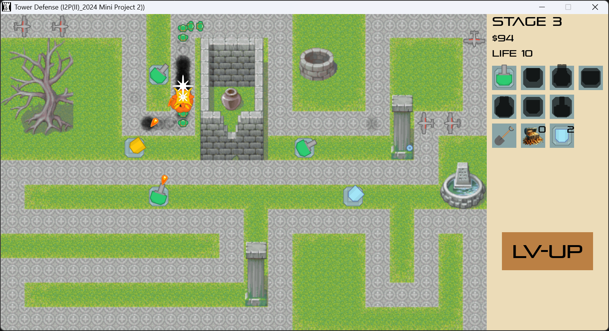
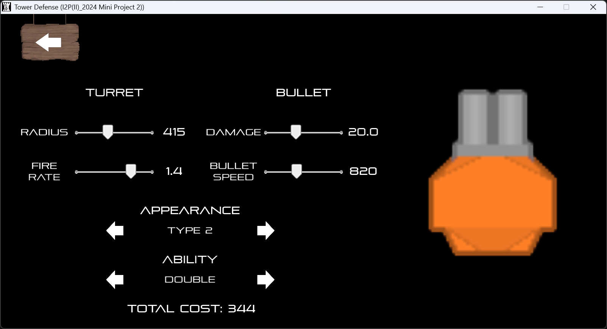
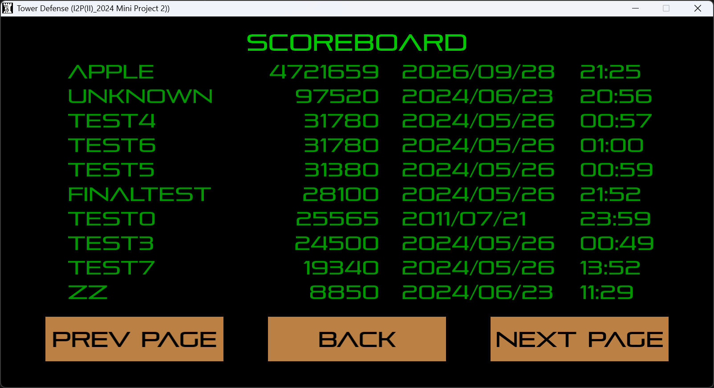
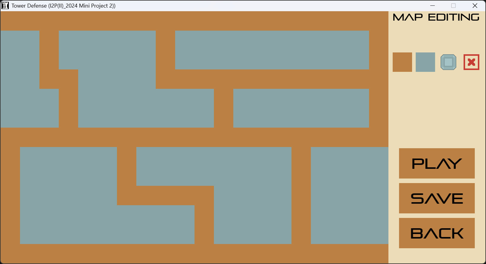
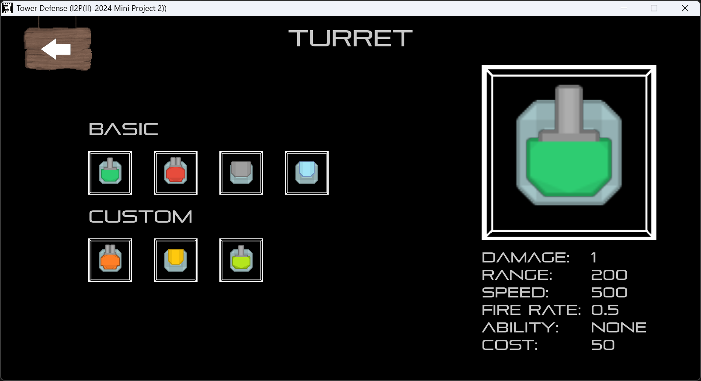

# I2P2 Tower Defense

## 專案簡介
本專案為「計算機程式設計二」（I2P）課程 Mini Project 2 的塔防遊戲，使用 C++ 搭配 Allegro5 遊戲引擎開發。課程提供基礎引擎骨架與初版塔防模板（`StartScene`、基本砲塔/敵人等），後續由小組自由擴充功能與內容。

## 開發環境
- C++
- Allegro5（`allegro_monolith-5.2.dll`）
- CMake + Ninja 建置

## 個人負責範圍
本 repo 由小組共用、非個人 GitHub commit 歷程（隊友程式碼以壓縮檔傳遞後手動合併，對應 `Combine 1`、`Combine 2` 兩次 commit），因此以下明確區分自行開發與隊友原始貢獻的部分：

**原創功能**（依 commit 紀錄）：
- Scoreboard 計分板系統（含日期時間、玩家名稱記錄，讀寫至 `Resource/scoreboard.txt`）
- Enemy Pathfinding：敵人路徑搜尋，以 BFS 從終點反向計算各格到終點的距離
- FreezerTurret：減速砲塔
- Shovel：移除已放置砲塔的工具
- Shop 系統
- CustomTurret：可自訂屬性的砲塔
- Gallery：砲塔／敵人圖鑑

**隊友原始貢獻、經本人除錯修正**：
- Props（CoinBox、FreeTurret）、LogInScene、MapEditScene（自訂地圖編輯器）等，透過 `Combine 1`／`Combine 2` 合併進本 repo。這部分程式碼原作者非本人，但下方〈已修復的問題〉三項 bug 皆是在這些程式碼中發現並修正的。

## 架構設計
沿用課程提供的引擎介面架構：`IScene`、`IObject`、`IControl` 為核心抽象介面，每個遊戲畫面（開始畫面、關卡選擇、遊玩畫面、商店、圖鑑、地圖編輯器、登入、設定、計分板、勝利／落敗畫面等）各自實作為一個 `IScene` 子類別，透過 `GameEngine::ChangeScene` 切換。

## 已修復的問題

開發過程中發現並修正了三個問題，其中一個會直接導致遊戲崩潰：

1. **砲塔升滿級後 UI 消失**（`Scene/PlayScene.cpp`，`LevelOnClick`）
   四種砲塔升到滿級時都會呼叫 `UIGroup->Clear()` 重繪 UI，但只有其中一種砲塔的分支有把被清空的游標目標圖示（`imgTarget`）重新建立並加回畫面，另外三種砲塔的分支漏了這段，導致升滿級後畫面缺角。修正方式是把缺漏的重建邏輯補齊到另外三個分支。

2. **自訂地圖地磚顯示錯誤**（`Scene/MapEditScene.cpp`，`OnMouseUp`）
   地圖編輯器調色盤有 4 種地磚（泥土、地板、牆、擦除），但點擊處理邏輯只寫了其中兩種的完整分支，導致「牆」完全無法放置、「擦除」後畫面留白而非正確顯示地磚。修正後 4 種地磚點擊放置行為一致。

3. **開始遊玩自訂地圖時遊戲崩潰**（`Scene/PlayScene.cpp`，`ReadMap`）
   自訂地圖存檔會寫入代表「牆」的字元，但負責讀取地圖並開始遊戲的 `ReadMap()` 只認得代表泥土／地板的兩種字元，讀到其他字元時會拋出未被攔截的例外，直接讓遊戲崩潰。修正方式是擴充讀檔邏輯以支援牆地磚，並重用既有的「已佔用」地磚狀態，讓牆同時具備「不可放置砲塔」的效果。

## 已知未完成功能
- 自訂砲塔（CustomTurret）的數值設定關閉遊戲後不會保留，目前沒有存檔／讀檔機制。

## Demo

*關卡遊玩畫面：砲塔沿路徑佈防，敵人依 BFS 計算出的路徑向終點推進*

*自訂砲塔：以滑桿調整射程、射速、傷害與子彈速度，並選擇外觀樣式與能力*

*計分板：記錄玩家名稱、分數與遊玩日期時間，資料保存於檔案*

*地圖編輯器：以調色盤選擇地磚類型繪製自訂地圖，可存檔後直接遊玩*

*圖鑑：檢視各類砲塔與敵人的資訊*